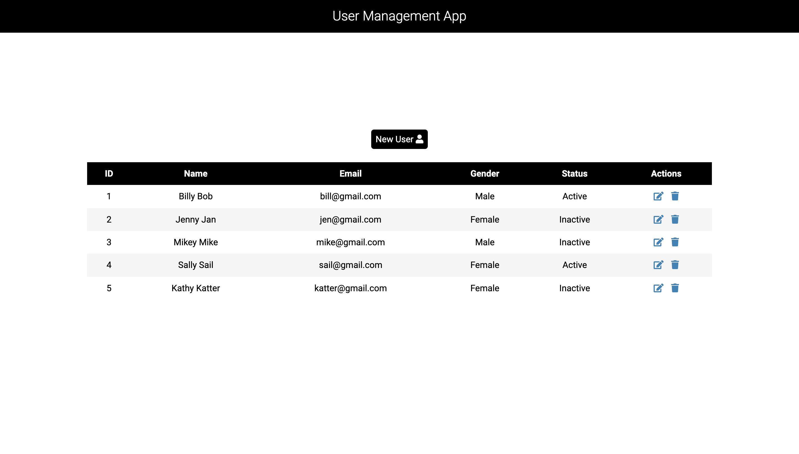

# User Management App
An application used to create, update, and delete a list of users. Keep track of a user's name, email, gender, and status in a sortable table.
* Heroku Deploy: [https://user-management-app-87972.herokuapp.com/](https://user-management-app-87972.herokuapp.com/)

### Preview

### Technologies:
* Programming Languages:
  * HTML
  * EJS
  * CSS
  * Javascript
  * Jquery
* Tech Stack:
  * MongoDB Atlas
  * Express JS
  * Node JS
* Others:
  * Font Awesome (Icons)